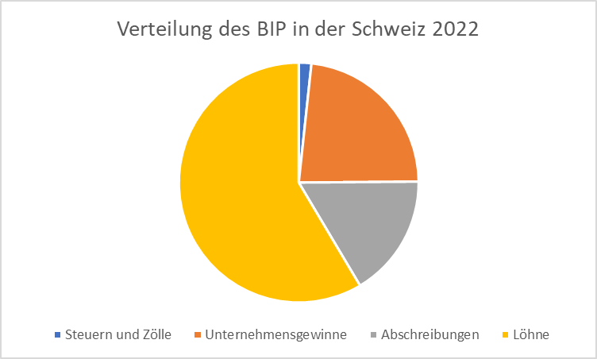

# Die Einkommensverteilung

Das BIP kann nicht nur aufgrund der Entstehung (Produktion) berechnet
werden. Eine andere Perspektive ist die Verteilung (Einkommen).

Für die Schweiz wird das BIP folgendermassen verteilt:

