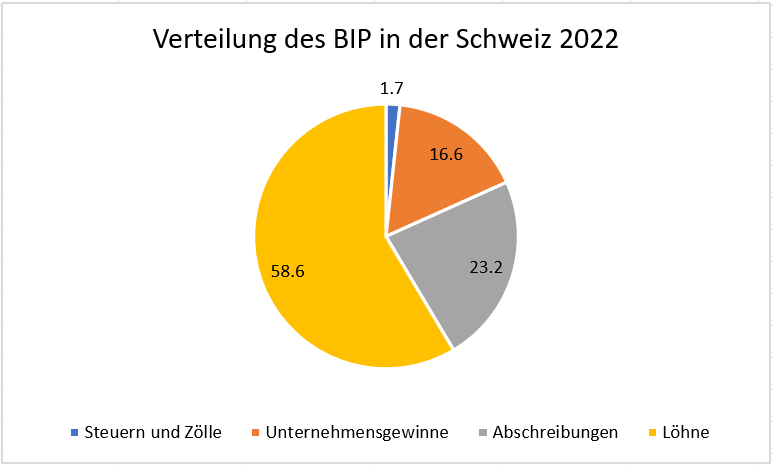

# Die Einkommensverteilung

Das BIP kann nicht nur aufgrund der Entstehung (Produktion) berechnet
werden. Eine andere Perspektive ist die Verteilung (Einkommen).

Für die Schweiz wird das BIP folgendermassen verteilt:

*Grafik in Anlehnung an Aymo Brunetti, Volkswirtschaftslehre: Lehrmittel
für die Sekundarstufe II und die Weiterbildung, 15. Auflage, Bern 2023,
Seite 102.*

Wie der Grafik entnommen werden kann, ist der grösste Teil das
Arbeitseinkommen. Die Unternehmensgewinne als zweitgrösster Teil sind
gerade noch halb so gross. Die Eigentümer verdienen damit in der Summe
weniger als ihre Angestellten.

Wie gross die Einkommensunterschiede sind ist damit allerdings noch
nicht geklärt. Dies ist Thema im hier verlinkten Jupyter Notebook.